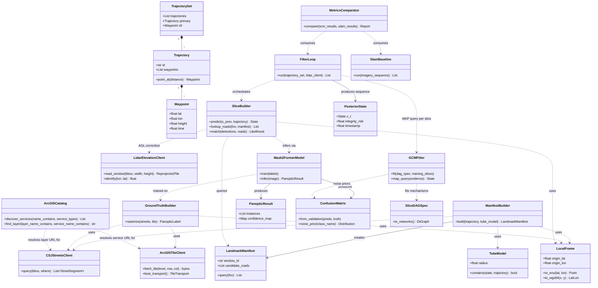

# Causal Semantic Navigation for Aviation — Integration Plan & Architecture (v3)

**Stack:** San Jose DPW cached imagery · San Jose Streets (CSJ) + LIDAR elevation · Mask2Former · DoWhy-GCM
**AOI:** City of San José, CA (pilot case study; NAIP/OSMnx retained as the generalization path beyond San Jose)
**Coordinate system:** WGS84 (EPSG:4326) for all storage/interop; local ENU tangent-plane frame for metric geometry (see §2)

---

## 1. Data sources (San Jose pilot)

| Source | What it provides | Format / access | Role |
|---|---|---|---|
| `DPW_ImageryCached2025` | High-res aerial imagery (~1.9 cm/px at native zoom) | ArcGIS cached tile service (WMTS-compatible), EPSG:3857 native | Ground-truth imagery for Mask2Former training + runtime observation frames |
| CSJ `Streets` | Road centerlines with width/lane attributes, refreshed weekly | ArcGIS Hub dataset (FeatureServer / GeoJSON export) | Replaces OSMnx as the road-network prior; also the source for buffer widths in label rasterization |
| USGS 3DEP `3DEPElevation` | Ground elevation (national seamless DEM mosaic) | Live ArcGIS ImageServer, `elevation.nationalmap.gov` — **not** San Jose's own data; San Jose's "Imagery & Elevation" LIDAR product (Valley Water) turned out to be contour lines, not a raster DEM, on inspection of a real download — see `docs/phase0_csj_streets_lidar.md` | Altitude correction — converts GPS-derived height to AGL, and supports FOV occlusion modeling (buildings/terrain blocking a road from view at low altitude) |

**Reprojection note:** the imagery service is EPSG:3857 (Web Mercator), a direct, datum-free projection of WGS84 — reproject at tile-fetch time, no datum transform needed. Streets exports typically support requesting output directly in EPSG:4326 via ArcGIS FeatureServer. The USGS 3DEP ImageServer also reprojects server-side (`bboxSR`/`imageSR`/`sr` = 4326), so no client-side warp is needed for elevation either.

---

## 2. Coordinate frame strategy

- **Storage / interop / SCM node values:** WGS84 (EPSG:4326) throughout — imagery georeference, street geometry, trajectory waypoints, and the aircraft state estimate `x_t = (lat_t, lon_t, height_t)`.
- **Metric geometry operations:** degrees of latitude/longitude are not uniform distances, so RNP tube radii, street buffer widths, and FOV-to-ground-distance projections are computed in a **local East-North-Up (ENU) tangent-plane frame**, anchored at `x_0` (or recomputed per trajectory window for long flights to limit projection distortion). Results are converted back to WGS84 before being stored or passed to the SCM.
- **Height reference:** GPS-derived height is typically ellipsoidal or MSL; LIDAR-derived ground elevation at `(lat, lon)` is needed to compute true AGL, which matters both for the 200–4000 ft AGL operating envelope and for FOV occlusion modeling (a road can be visually blocked by terrain or buildings depending on AGL, not just distance).

---

## 3. Causal model reformulation — state estimation, not labeling

### 3.1 What the MAP query actually estimates

The DAG's inference target is the aircraft's current state, `x_t = (lat_t, lon_t, height_t)`. Detected roads and intersections are **evidence nodes** in the causal graph — they inform the estimate of `x_t` through a measurement/likelihood relationship, the same conceptual role landmarks play in classical landmark-based SLAM. The SCM's job is to model *how* image evidence constrains `x_t`, and to produce both the MAP estimate and an integrity-risk figure describing how confidently that estimate can be trusted.

### 3.2 Trajectory structure as a prior

- `T = {t_1, ..., t_n}` — a known set of candidate trajectories, each a sequence of 4D waypoints `(lat, lon, height, time)`.
- `t_p ∈ T` — the primary/planned trajectory.
- `x_0` — the known starting state.
- **Containment model:** the aircraft is assumed to remain within an RNP-style tube around whichever trajectory it is currently flying (or within a transition corridor between two trajectories, including a return path to `x_0`) at least 95% of the time. This bounds the reachable state space at every point in the flight, before the flight begins.
- **Tube radius:** set prior to flight and, in the initial implementation, constant along a given trajectory — but the actual value is deliberately left open, to be explored as a function of CONOPS, altitude, and similar factors rather than fixed at this stage. Architecturally it's treated as a configurable parameter passed into the manifest builder and containment check, independent of landmark geometry — nearby roads/intersections don't influence its size, and it isn't recomputed from what the manifest happens to contain. This also means later sweeps across candidate radii (or variable/segment-dependent radii) are a matter of re-running the manifest builder with a different input, not a redesign.

Because `T` is known a priori, the tube geometry lets you compute, **before flight**, which parts of the network the aircraft could possibly be in at any given time — which is the basis for precomputing the DAG structure rather than building it live.

### 3.3 Precomputed landmark manifests

For each trajectory `t_i` (and each transition corridor between trajectories), discretize into time/space windows. For each window:
1. Compute the tube's maximal spatial envelope (in the local ENU frame, converted to WGS84 for storage).
2. Query the CSJ Streets layer against that envelope to build a **candidate landmark manifest**: the roads/intersections that could possibly be visible from any state within the tube at that window, with their expected geometry as a function of candidate `x_t`.

This manifest is computed once, offline, per trajectory/window — not queried live against the full city on every frame. It becomes the static "Possible roads" input for every slice that falls in that window.

**Pinning:** the manifest is fixed for the flight-planning cycle it was built for. CSJ Streets' weekly refresh does not trigger a mid-cycle rebuild — a new manifest is only generated when `T` itself is replanned.

### 3.4 Chain-structured DAG (per-timestep slice)

Each time slice is a small causal subgraph:

```
x(t-1) posterior --> Predict x(t) --> Possible roads --> Mask2Former match --> Posterior x(t) --> x(t+1) prior
                      (trajectory prior     (precomputed          (detected features
                       + tube containment)   manifest ∩ FOV(t))    vs. manifest)
```

- **Predict x(t):** a deterministic mechanism, not a fitted/statistical one. Initial version: given `x(t-1)` and elapsed time, select the valid point along the active trajectory (primary trajectory or, during a transition, the active transition path) toward the next waypoint that fits a simple kinematics model — e.g., constant-velocity progress along the path segment. This yields a single candidate point; the (constant) tube radius supplies the uncertainty band around it for the containment/matching step downstream. More expressive kinematics (turn-rate limits, acceleration bounds) can replace this function later without changing the slice's DAG structure — only this one node's mechanism changes.
- **Possible roads:** deterministic lookup — intersect the predicted FOV with the precomputed manifest for the current trajectory window. No live spatial query.
- **Mask2Former match:** the segmentation model's detections (road/intersection instances + confidence) matched against manifest landmarks, producing a likelihood over candidate `x_t`.
- **Posterior x(t):** the MAP estimate given predicted state + matched evidence — this is the slice's output, and the integrity-risk metric is derived from how sharply peaked / well-supported this posterior is.

**Why this is tractable:** conditioning on the boundary nodes `x(t-1)` and `x(t+1)` d-separates each slice's internal nodes from every other slice's. This is a Markov blanket in the standard sense — the same locality property that makes a Kalman/particle filter cheap to run online rather than re-solving the full joint distribution over the whole flight history at every step. Practically, this means: **determine which trajectory window the aircraft is in (from the previous posterior + flight-plan mode), pull that window's precomputed manifest, run one slice-local update.** No global re-solve.

### 3.5 DoWhy-GCM integration note

DoWhy-GCM is built to fit mechanisms on a static graph and answer do/counterfactual/MAP queries against it — it isn't natively a recursive filter. The fit here is: **fit the within-slice mechanisms once** (predict → possible-roads lookup → match-likelihood → posterior), then **write the slice-to-slice chaining as a surrounding loop** — each call feeds the previous posterior in as evidence for the "Predict x(t)" node and reads the new posterior back out as the MAP query result, which becomes the next call's input. GCM handles the causal reasoning within a slice; your own filtering loop handles sequencing across slices. This preserves the "don't re-solve everything every frame" property without requiring GCM itself to support online/recursive inference.

---

## 4. Updated pipeline architecture

```
San Jose imagery ----+
                      +--> Ground truth builder --> Mask2Former --+
CSJ Streets + LIDAR --+       (panoptic labels,                   |
                                street widths as buffer source)    v
                                                            Per-slice scene graph
                                                         (predict -> possible roads ->
                                                          match -> posterior x_t)
                                                                    |
                                                                    v
                                                            DoWhy-GCM (slice-local
                                                             mechanisms, MAP query)
                                                                    |
                                                                    v
                                                       Posterior x_t + integrity risk
                                                         (feeds next slice's prior)
```

Offline / precompute (runs once per trajectory set `T`, before flight):
```
T (trajectories) + RNP tube model + CSJ Streets --> Trajectory-window landmark manifests
```

These manifests are consumed both by the ground-truth builder (to scope which imagery tiles/streets need labels) and by the runtime "Possible roads" node (as a lookup, not a live query).

---

## 5. Phased plan

**Phase 0 — Data plumbing (San Jose-specific)**
- Build the ArcGIS tile client for `DPW_ImageryCached2025` (WMTS or `/export`/`/tile` endpoints) with EPSG:3857→4326 reprojection
- Pull CSJ `Streets` via FeatureServer export in EPSG:4326; pull LIDAR elevation product for the AOI
- Stand up the local ENU tangent-plane utilities (WGS84 ↔ local metric conversion) used by every downstream geometry step

**Phase 1 — Trajectory set + precomputed manifests**
- Define `T`, `t_p`, `x_0`, and the RNP-style tube model
- Implement the offline manifest builder: trajectory windows → tube envelope → CSJ Streets query → per-window landmark manifest

**Phase 2 — Segmentation baseline**
- Rasterize ground-truth panoptic labels using CSJ street geometry/widths over San Jose imagery tiles
- Fine-tune Mask2Former; build the confusion matrix → exogenous noise priors

**Phase 3 — Slice-local SCM**
- Encode the per-slice DAG (§3.4) in DoWhy-GCM; fit mechanisms for Predict/Possible-roads/Match/Posterior
- Implement the surrounding filter loop that chains slices via `x(t-1) → x(t)` evidence passing

**Phase 4 — Integrity metric + SLAM baseline comparison**
- Derive integrity risk from posterior sharpness/anomaly score at each slice
- Run the modified-SLAM baseline in parallel; compare Integrity Risk / Time-to-Alert / Availability

**Phase 5 — Failure-mode injection**
- Inject synthetic noise/obfuscation into imagery per your original methodology; evaluate both approaches under degraded conditions

---

## 6. Repo/module structure (updated)

The layout below is aspirational for everything past Phase 0; the
`data/acquisition` role is implemented today as `src/csnav/data/arcgis/`
(see "Implementation note" below for why).

```
causal-semantic-nav/
├── data/
│   ├── acquisition/          # San Jose tile client, CSJ Streets + LIDAR pull (all -> EPSG:4326)
│   └── ground_truth/         # rasterization: street geometry (+ widths) -> panoptic label maps
├── geometry/
│   └── local_frame.py        # WGS84 <-> local ENU conversions, used by every metric operation
├── trajectory/
│   ├── trajectory_set.py     # T, t_p, x_0, RNP tube model
│   └── manifest_builder.py   # offline: trajectory windows -> precomputed landmark manifests
├── segmentation/
│   ├── train_mask2former.py
│   ├── infer.py
│   └── confusion_matrix.py
├── scene_graph/
│   └── slice_builder.py      # per-timestep: predict -> possible roads (manifest lookup) -> match
├── causal_model/
│   ├── slice_dag_spec.py     # static per-slice DAG structure
│   ├── fit_gcm.py            # DoWhy-GCM mechanism fitting (slice-local)
│   └── filter_loop.py        # chains slices: x(t-1) evidence in, x(t) MAP out, feeds x(t+1)
├── baseline_slam/
│   └── ...
└── eval/
    └── compare_metrics.py
```

**Implementation note (Phase 0):** the imagery and CSJ Streets clients are
San Jose-specific ArcGIS Server clients that share one set of
REST-catalog/model/projection utilities, so in `src/csnav/` they live
together as one installable package rather than split under a separate
`data/acquisition/` tree. The ground-elevation client sits alongside that
package rather than inside it: it turned out San Jose's own "Imagery &
Elevation" LIDAR product (Valley Water) is contour lines, not a raster DEM
(confirmed against a real download — see `docs/phase0_csj_streets_lidar.md`),
so ground elevation is instead sourced from USGS 3DEP's national elevation
ImageServer — a different provider entirely, with nothing to discover (a
fixed, documented federal endpoint) and no `geo.sanjoseca.gov` catalog to
share:

```
src/csnav/data/
├── arcgis/
│   ├── models.py        # ServiceRef, TileInfo, LevelOfDetail, Extent, ServiceMetadata
│   ├── projections.py   # EPSG:4326 <-> EPSG:3857 helpers (pyproj)
│   ├── catalog.py       # ArcGISCatalog: recursive service discovery (+ find_layer() for
│   │                     # datasets published as a sublayer of a shared, generically-named
│   │                     # service, e.g. CSJ Streets) - no hardcoded service names
│   ├── tiles.py         # ArcGIS tileInfo-based tile bounds / row-col-for-extent math
│   ├── client.py         # ArcGISTileClient: imagery via WMTS / /tile / /export
│   ├── reproject.py       # warp fetched imagery tiles from EPSG:3857 to EPSG:4326 (rasterio)
│   └── streets.py          # CSJStreetsClient: paginated /query against the Streets layer, GeoJSON in EPSG:4326
└── lidar.py                  # LidarElevationClient: live queries against USGS 3DEP's ImageServer
                                # (read_window/identify), EPSG:4326 - no local cache, no discovery
```

See `docs/phase0_arcgis_tile_client.md` and `docs/phase0_csj_streets_lidar.md`
for the rationale behind this layout, the discovery-over-hardcoding approach
the ArcGIS clients take, and why the LIDAR client doesn't.

**Implementation note (Phase 1):** the trajectory set, tube model, and offline
manifest builder land under `src/csnav/` for the same reason, alongside a
visualization package and a `configs/scenarios/` tree holding the versioned
`T` / `t_p` / `x_0` / CONOPS definitions (tube radius among them, so radius
sweeps are a config change rather than a code change - see §8):

```
src/csnav/
├── trajectory/
│   ├── waypoints.py         # Waypoint (4D, WGS84), TrajectoryRole
│   ├── trajectory.py        # Trajectory, TrajectorySet, TransitionRule, TrajectoryWindow
│   ├── transition.py        # TransitionModel: generates the family a rule admits (see below)
│   ├── tube.py              # TubeModel: lateral containment + corridor/envelope geometry
│   ├── coverage.py          # visible footprint (tube + camera reach), TileRef, AGL providers
│   ├── manifest.py          # LandmarkManifest, ManifestBundle, JSON pinning
│   ├── manifest_builder.py  # the offline builder (§3.3), and StaticStreetsSource
│   └── config.py            # Scenario / ConopsConfig, versioned YAML loading
├── geometry/
│   ├── fov.py               # FieldOfView -> ground footprint extents
│   ├── camera.py            # SensorPose, AttitudeMargin, Camera -> ground reach
│   └── shapes.py            # WGS84 <-> ENU conversion for whole shapely geometries
└── viz/
    ├── graph_view.py        # Plotly: the transition graph, permitted routes, profiles
    └── map_view.py          # folium: corridors, transition families, tiles, manifests
```

**Refinement to §3.2 (Phase 1):** transition corridors are *generated*, not
authored. A transition is not known before flight - it may initiate at any arc
length along the route being flown, not only at a waypoint - so a scenario
declares a `TransitionRule` (which hand-offs are permitted, and optionally the
arc-length window in which one may begin) and `TransitionModel` generates the
family of paths that rule admits: initiation anywhere in the window, arrival at
the first target waypoint ahead of where the initiation point projects onto the
target's ground track, and a cubic Hermite spline between them matching both
routes' headings. The Hermite is a placeholder for a dynamics model. The
*family*, not any single path, is the object of interest: initiation is
continuous, so the region the family sweeps is the set of positions the
aircraft may legitimately occupy while transitioning.

Two consequences worth recording. A **return to `x_0`** is an ordinary
candidate trajectory whose last waypoint is `x_0` (one per outbound route),
reached by the same machinery - not a special kind of edge. And **composite
routes need no declaration**: "fly `t_p`, divert to an alternate, then take
that alternate's return" is a path through the transition graph, enumerated by
`TrajectorySet.route_paths()`.

**Refinement to §3.3/§3.4 (Phase 1):** the sensor is a `Camera` - a field of
view plus a `SensorPose` (mounting relative to the body frame; nadir for the
first prototype) plus an `AttitudeMargin` bounding how far off level the
aircraft may be, with a larger allowance near waypoints where the turns are.
Manifest and tile footprints are sized from the camera's worst-case ground
reach across a window rather than from the cone angle alone. The margin
defaults to zero, so the first proof of concept behaves as if the aircraft were
level.

`data/ground_truth/`, `segmentation/`, `scene_graph/`, `causal_model/`,
`baseline_slam/` and `eval/` remain unimplemented (Phase 2+). See
`docs/phase1_trajectory_manifests.md`.

---

## 7. Software architecture — UML class diagram

The class diagram below mirrors the repo/module structure in §6: acquisition and ground-truth
classes on one side, trajectory/manifest classes feeding the scene graph, segmentation feeding
both ground truth and the scene graph's matching step, and the causal model's `FilterLoop`
orchestrating `SliceBuilder` and `GCMFitter` per slice before handing off to evaluation.



This block renders natively on GitHub/GitLab and in most Markdown viewers that support Mermaid.
If viewing in a renderer without Mermaid support, paste the code block into the
[Mermaid Live Editor](https://mermaid.live) to view it.

---

## 8. Assumptions locked in / remaining items

**Resolved:**
- **Tube radius:** constant, set prior to flight, independent of landmark geometry. Variable/segment-dependent radii deferred to a later iteration.
- **Manifest staleness:** pinned per flight-planning cycle; not rebuilt against CSJ Streets' weekly refresh mid-cycle.
- **LIDAR vintage:** confirmed recent enough for use as-is against current imagery/street conditions.
- **Slice window granularity:** a sensitivity study is planned (per the original methodology's sensitivity-study step) but not expected to be a significant risk.
- **Predict x(t) mechanism:** deterministic, not fitted — initially a constant-velocity waypoint-fitting function along the active trajectory/transition path. Implement as a custom deterministic mechanism in DoWhy-GCM's framework rather than a statistically fit one; swapping in a more expressive kinematics model later only touches this one node.

**Still worth tracking as the implementation proceeds:**
- The tube radius itself is intentionally left unfixed — it will be explored as a function of concept of operations, altitude, and similar factors, rather than pinned to a single value now. The architecture should treat it as a **configurable input** to the manifest builder and containment check (a parameter passed in per trajectory/CONOPS, not a constant baked into the pipeline), so that sweeping different radii later — including a future sensitivity study on integrity risk vs. tube radius — doesn't require touching the manifest-building or DAG logic, only the parameter value supplied to it.
- Whether the transition-corridor tube (between trajectories, or back to `x_0`) should share whatever radius is chosen for the primary trajectory or be treated as its own case once that logic is implemented.
